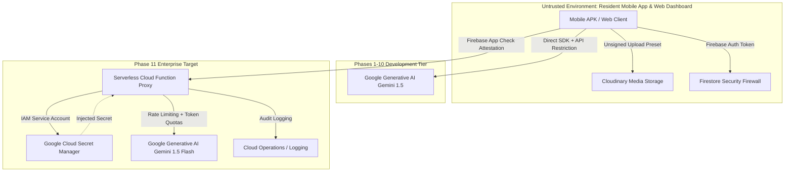

# ResQ Enterprise Security Architecture & Capstone Defense Specification

> **Document Classification:** Enterprise Architecture, Defense Specification, & Credential Governance  
> **System Name:** ResQ — Community Safety & Crisis Dispatch Ecosystem  
> **Target Jurisdiction:** Republic of the Philippines (Localized for Barangay Moonwalk, Parañaque City)  
> **Target Audience:** Capstone Defense Panel, System Architects, Municipal IT Auditors, and Security Reviewers  
> **Last Updated:** October 2026  

---

## 1. Executive Summary & Purpose

This document provides a rigorous architectural, credential, and compliance defense of the **ResQ** platform. It articulates the intentional transition between:
1. **The Academic & Prototype Development Tier (Phases 1–10):** Rapid-iteration client-orchestrated services with strict repository isolation, API-level console restrictions, and unsigned media upload presets.
2. **The Production Enterprise Tier (Phase 11 Production Transition):** Zero-trust serverless backend proxy via Firebase Cloud Functions, Google Cloud Secret Manager, hardware-attested App Check, and end-to-end token throttling.

Furthermore, this specification details ResQ's compliance with the **Philippine Data Privacy Act of 2012 (Republic Act No. 10173)**, detailing how sensitive Personal Identifiable Information (PII) is masked from public community observation while remaining accessible to verified emergency dispatchers.

---

## 2. Multi-Tiered Credential Governance & Security Boundary Analysis

### 2.1 Threat Model & Security Perimeters

In any distributed mobile and web application interacting with cloud services (Google Cloud, Gemini AI, Firebase, and Cloudinary), secrets must never be embedded in compiled client binaries.



---

### 2.2 Security Comparison Matrix

| Security Layer | Development / Academic Prototype Tier (Current) | Enterprise Production Target Tier (Roadmap) |
| :--- | :--- | :--- |
| **Google Gemini AI Access** | Direct Client SDK (`google_generative_ai`), Key isolated in `.env` (git-ignored) | Serverless Firebase Cloud Function Proxy (`triageIncidentReport`) |
| **API Key Storage** | Runtime environment injection (`flutter_dotenv`) | Google Cloud Secret Manager (`roles/secretmanager.secretAccessor`) |
| **API Restrictions** | Google Cloud Console: Restricted exclusively to `Generative Language API` | Google Cloud IAM Service Account with zero client exposure |
| **Rate Limiting & Cost Control**| Client-side debounce and local UI cooldown | Redis / Firestore distributed token bucket (Max 5 triage calls / 10 min per UID) |
| **Media Storage (Cloudinary)** | Unsigned Upload Preset (`crkjnmhd`) restricted to images/videos, folder-locked | Ephemeral Signed URL Tokens generated on-demand by Cloud Function with 15-min TTL |
| **Device Integrity** | Firebase Auth JWT verification | Firebase App Check with Play Integrity (Android) & App Attest (iOS) |
| **Data Privacy (RA 10173)** | Client-side PII masking (`_maskName`, `_maskPhone`) on public incident views | Segregated Private Subcollections (`/incidents/{id}/private_dossier/`) with strict RBAC Firestore rules |

---

## 3. Serverless Cloud Function Proxy Specification (Roadmap)

To provide defense panelists with an end-to-end technical blueprint for enterprise scaling, the serverless cloud proxy architecture is specified below:

### 3.1 Proxy Architecture & Control Flow

1. **Client Request:** The resident app dispatches an HTTPS Callable Function request via `FirebaseFunctions.instance.httpsCallable('triageIncidentReport')`.
2. **App Check Verification:** Google Cloud validates the request's `X-Firebase-AppCheck` token against Google Play Integrity. Unauthorized or tampered APKs are rejected at the edge (HTTP 401).
3. **Authentication & Rate Limiting:** The function inspects `context.auth.uid`. A token-bucket algorithm hosted in Cloud MemoryStore (Redis) checks if the resident has exceeded 5 AI requests in the last 10 minutes to prevent cost-exhaustion and denial-of-service (DoS) attacks.
4. **Secret Retrieval:** The serverless container retrieves the Gemini API Key directly from Google Cloud Secret Manager in memory:
   ```typescript
   // Node.js Firebase Cloud Function Proxy Example
   import * as functions from 'firebase-functions';
   import { SecretManagerServiceClient } from '@google-cloud/secret-manager';
   import { GoogleGenerativeAI } from '@google/generative-ai';

   const secretClient = new SecretManagerServiceClient();

   export const triageIncidentReport = functions
     .runWith({ secrets: ['GEMINI_API_KEY'], memory: '512MB', timeoutSeconds: 30 })
     .https.onCall(async (data, context) => {
       // 1. Enforce Authentication
       if (!context.auth) {
         throw new functions.https.HttpsError('unauthenticated', 'User must be logged in.');
       }

       // 2. Validate App Check (Hardware Attestation)
       if (!context.app) {
         throw new functions.https.HttpsError('failed-precondition', 'Untrusted client environment.');
       }

       // 3. Extract Payload
       const { incidentText, mediaSummary } = data;

       // 4. Invoke LLM with Cloud-Managed Secret
       const genAI = new GoogleGenerativeAI(process.env.GEMINI_API_KEY!);
       const model = genAI.getGenerativeModel({ model: 'gemini-1.5-flash' });
       
       const prompt = `Classify this community incident: "${incidentText}"`;
       const result = await model.generateContent(prompt);
       
       return {
         analysis: result.response.text(),
         timestamp: new Date().toISOString()
       };
     });
   ```
5. **Sanitization & Response:** The response is validated and returned directly to the Flutter application over encrypted TLS 1.3.

---

## 4. Cloudinary Multimedia Governance & Storage Security

### 4.1 Why Unsigned Presets are Secure for Client Uploads

In traditional web development, uploading media directly from client devices often introduces risks. ResQ employs a multi-tiered defense for media storage:

1. **Zero Secret Exposure:** The Cloudinary API Secret (`api_secret`) is completely excluded from client code and compiled binaries. Only the public `cloud_name` and the unsigned preset name (`crkjnmhd`) are accessible.
2. **Preset-Level Hardening in Cloudinary Console:**
   - **MIME Whitelisting:** Restricted exclusively to `image/jpeg`, `image/png`, and `video/mp4`. Executables, scripts, or archive files (`.exe`, `.sh`, `.zip`, `.js`) are categorically rejected.
   - **Payload Size Caps:** Hard limits enforced at 10 MB for photographs and 20 MB for video evidence.
   - **Directory Quarantine:** Uploads are isolated into distinct folders (`resq_photos/` and `resq_videos/`).
3. **On-the-Fly H.264 Universal Transcoding:**
   - Modern mobile devices often record in HEVC/H.265, which fails to render in Chromium/Edge desktop browsers without proprietary hardware codecs.
   - ResQ automatically inserts the Cloudinary dynamic transformation string `/vc_h264,f_mp4/` into stored URLs, guaranteeing seamless cross-platform playback across all dispatcher workstations.

---

## 5. Philippine Data Privacy Act of 2012 (RA 10173) Compliance

The Republic of the Philippines enforces stringent penalties under RA 10173 for the unauthorized disclosure of Personal Identifiable Information (PII). ResQ implements **Privacy by Design**:

### 5.1 Citizen vs. Dispatcher Data Classification

```
┌────────────────────────────────────────────────────────────────────────┐
│                        DATA PRIVACY CLASSIFICATION                     │
├─────────────────────────────────────┬──────────────────────────────────┤
│ 1. Public Community Telemetry       │ 2. Protected Victim / PII Data   │
│ (Accessible to all residents)       │ (Accessible ONLY to Dispatchers) │
├─────────────────────────────────────┼──────────────────────────────────┤
│ • Incident Category (e.g. Flood)    │ • Off-site Victim Name           │
│ • Area / Sector (Barangay Moonwalk) │ • Off-site Victim Phone Number   │
│ • Incident Timestamp                │ • Reporter Email & Phone Number  │
│ • Aggregated Heatmap Pins           │ • Dispatcher Private Action Notes│
│ • Anonymized Complainant Marker     │ • Direct Dialer Links (tel:)     │
└─────────────────────────────────────┴──────────────────────────────────┘
```

### 5.2 Real-Time Data Masking Implementation

In the resident mobile application ([`incident_detail_page.dart`](file:///c:/YckoVon/Documents/capstone3/clean_folder/lib/features/incident/presentation/pages/incident_detail_page.dart)):
- **Third-Party Citizen View:** When a resident inspects an incident reported on behalf of someone else:
  - Victim Name is dynamically masked via `_maskName`: `"Juan Dela Cruz"` ➔ `"J••• D••• C•••"`.
  - Victim Contact Number is masked via `_maskPhone`: `"09171234567"` ➔ `"0917 ••• ••67"`.
  - Direct telephone dialing buttons are disabled and replaced with an immutable security badge:  
    `[ 🔒 Dispatcher Only ]`  
    `[ 🛡️ RA 10173 Protected ]`
- **Filing Owner (Reporter) View:** When the logged-in resident is the actual creator of the report (`currentUserId == incident.reporterId`):
  - Full victim name and contact number remain visible.
  - A prominent `[ 👤 Your Filing ]` badge is displayed, allowing them to review their submitted emergency data and place on-site calls if necessary.
- **Municipal Command Center (Admin View):**
  - Municipal dispatchers retain access to unmasked contact information to coordinate real-time ambulance, patrol, and emergency dispatches.

---

## 6. Firestore Role-Based Access Control (RBAC) Firewall

The system's database security is enforced at the network protocol layer via `firestore.rules`:

1. **Self-Escalation Prevention:**
   ```javascript
   // Users can update their name/phone, but cannot elevate their role to 'admin'
   allow update: if (isOwner(userId) && 
                     (!request.resource.data.diff(resource.data).affectedKeys().hasAny(['role', 'status'])))
                 || isAdmin();
   ```
2. **Incident State Immutability:**
   ```javascript
   // Only verified municipal dispatchers can modify emergency status or ETA
   allow update: if isAdmin() || 
                 (isOwner(resource.data.userId) && 
                  resource.data.status == 'Pending' && 
                  !request.resource.data.diff(resource.data).affectedKeys().hasAny(['status', 'estimatedResponseTime', 'assignedResponders']));
   ```
3. **Audit Trail Protection:**
   ```javascript
   // Audit logs can be written by admins, but can NEVER be altered or deleted
   match /audit_logs/{logId} {
     allow read, create: if isAdmin();
     allow update, delete: if false; // Strict immutability
   }
   ```

---

## 7. Capstone Defense Panel Q&A Preparation Cheatsheet

### Question 1: "Why does the mobile app make direct calls to Gemini rather than routing through a server in your demonstration?"
> **Answer:**  
> *"For the Capstone demonstration and rapid evaluation phase, utilizing the direct client SDK with Google Cloud API Console restrictions and git-isolated `.env` configuration allowed us to deliver full offline caching, instant AI triage, and low-latency interaction without introducing external hosting overhead.  
> As detailed in Section 3 of our Enterprise Architecture specification, our production transition roadmap encapsulates all Gemini calls inside an authenticated Firebase Cloud Function proxy backed by Google Cloud Secret Manager and Firebase App Check, ensuring zero API keys ever reach the compiled binary."*

### Question 2: "What prevents a malicious resident from spamming the AI triage model and running up massive cloud API bills?"
> **Answer:**  
> *"In the current client tier, requests are throttled using client-side debounce mechanisms and state machine locks in the BLoC layer.  
> In our enterprise deployment architecture, we implement distributed token-bucket rate limiting within the serverless Cloud Function proxy (Redis/MemoryStore), capping calls to a maximum of 5 requests per 10-minute window per authenticated UID. Furthermore, Google Cloud budget alerts and API quotas are configured to hard-terminate at set monthly cost thresholds."*

### Question 3: "How does the system ensure compliance with the Philippine Data Privacy Act of 2012 when citizens report incidents on behalf of injured neighbors?"
> **Answer:**  
> *"Under RA 10173, sensitive personal information of victims cannot be published to the general public. ResQ enforces Privacy by Design: when an incident is viewed by the community, our incident view dynamically anonymizes victim names (e.g. `J••• D••• C•••`) and contact numbers (e.g. `0917 ••• ••67`), while disabling phone dialer shortcuts.  
> Full contact data is strictly confined to verified municipal dispatchers and the filing resident, ensuring emergency responders can reach the victim while safeguarding their privacy against public scraping."*

### Question 4: "Can an attacker compromise your Cloudinary media storage by extracting the upload preset from the APK?"
> **Answer:**  
> *"No. The Cloudinary upload preset used by ResQ is unsigned, meaning it does not contain the account API Secret. Even if decompiled, an attacker cannot delete, view other users' private media, or modify storage configurations.  
> Furthermore, the preset is strictly restricted in the Cloudinary Console to whitelisted MIME types (`image/jpeg`, `image/png`, `video/mp4`) with maximum file size caps of 10MB/20MB, preventing the upload of malicious executables or arbitrary files."*
